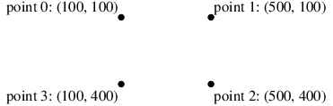
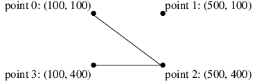
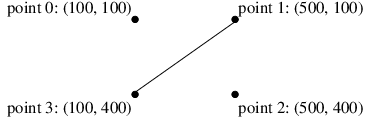
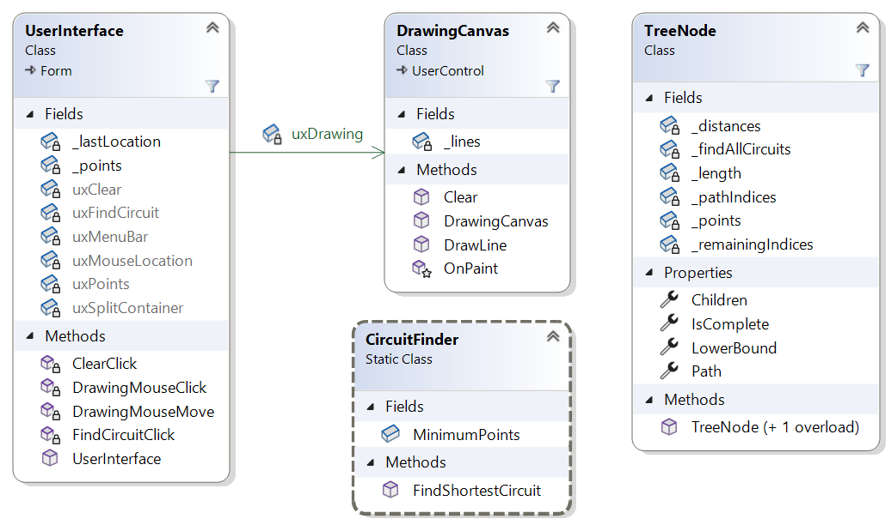

# Homework Assignment 5: Traveling Salesperson Problem Revisited

For this assignment, you will improve the performance of the model solution for Homework 3.

## 0. Table of Contents

[TOC]

## 1. User Requirements

The company using the program you wrote for Homework 3 now needs to use it for somewhat larger sets of points - perhaps as many as 18. The performance of your earlier solution is unacceptable for data sets this large. They would like for you to improve the performance so that it handles such data sets quickly. Otherwise, the user requirements are unchanged.

## 2. Starting the Assignment

Create a GitHub repository using the link provided on the Canvas assignment, and clone it to your local machine.  The repository contains the model solution to Homework 3 with the **Ksu.Cis300.PriorityQueueLibrary** project from the model solution to Lab Assignment 25 added. In addition, some tests have been added to the unit test code in **CircuitFinderTests.cs**, and a new unit test file, **TreeNodeTests.cs**, has been added to the **Ksu.Cis300.TravelingSalesperson.Tests** project.

## 3. User Interface

The program should look and behave exactly like the model solution to Homework 3, except that it should typically take less time for larger sets of points.

## 4. Improvements to the Shortest Circuit Algorithm

In this section, we will discuss two improvements that you will make to the algorithm.

### 4.1. A Better Lower Bound

The solution to Homework 3 prunes paths in the state space tree if it determines that the path can't lead to a shortest circuit. To do this, it relied on computing a lower bound on any circuit that begins with the path followed so far. This lower bound was fairly straightforward - the length of the path followed so far plus the distance from its endpoint directly back to its starting point. Thus, it uses no information about the remaining points to be included in the circuit. If we can use these points to obtain a better lower bound, we can potentially prune more paths from the state space tree.

Consider, for example, the following four points:

The distances between pairs of these points are shown in the following table:
$$
\begin{array}{c|cccc}
   & 0 & 1 & 2 & 3 \\
\hline
 0 & - & 400 & 500 & 300 \\
 1 & 400 & - & 300 & 500 \\
 2 & 500 & 300 & - & 400 \\
 3 & 300 & 500 & 400 & -
\end{array}
$$
For example, the distance from point 0 to point 2 is 500, shown in row 0, column 2, of the above table. Suppose the algorithm has already found the circuit \<3, 2, 1, 0\>, which turns out to be the shortest circuit, with a length of 1400. Suppose it next tries the path \<3, 2, 0\>, which has a length of 900, as shown in the following figure:

The distance back to point 3 is 300; hence, the lower bound is 1200 \< 1400. We therefore continue on to point 1, completing a circuit of length 1800, which is too long.

Suppose that instead of simply using the path length plus the distance from point 0 back to point 3 as our lower bound, we instead use the path length plus some measure that incorporates both point 1 and point 3. Any shortest circuit must reach both of these points after following the current path. Furthermore the path to either of these points must come from either point 0 (the end of the current path) or point 1 (the only remaining point). Thus, we could reason that in order to get to point 1, we must follow a path of length 400 (we can't go from point 1 to point 1), and in order to get to point 3, we must follow a path of at least 300 (the minimum of the distances from points 0 and 1). Therefore, any circuit starting with \<3, 2, 0\> must have length at least 900 + 400 + 300 = 1600 > 1400. Using this lower bound, we can prune this path at this point.

To summarize this lower bound calculation, let:

- *p* be the length of the current path;
- *R* be the set of remaining points;
- *u* be the starting point of the current path;
- *v* be the ending point of the current path;
- *d*(*a*, *b*) be the distance from point *a* to point *b* if *a* &ne; *b*, or &infin; otherwise.

We then define the lower bound to be:
$$
p + \sum_{b \in R \cup \{u\}} \min \{d(a, b) \mid a \in R \cup \{v\}\}
$$
Note that if *R* is empty (i.e., if there are no remaining points), the summation has only one element, where *b* = *u* (the start of the path). Furthermore, the set within this element also contains only one element, *v* (the end of the path). Thus, in this case, the lower bound is *p* + *d*(*v*, *u*), which is the length of the complete circuit.

Continuing with the above example, suppose our current path is simply \<3, 1\>, whose length is 500:

For the lower bound calculation, we need to consider points 0, 2, and 3 for the sum. For each of these, we need to find the minimum distance from points 0, 1, and 2. The lower bound is therefore the sum of:

- The current path length: 500
- The minimum distance to 0: 400
- The minimum distance to 2: 300
- The minimum distance to 3: 300

The sum is 1500 > 1400, so we can prune this path as well. Note that the original lower bound would have been 500 + 500 = 1000 < 1400, and pruning would not have been possible.

### 4.2. Branch and Bound

While the above lower bound results in better pruning of the search, a better search algorithm leverages this lower bound even more effectively. This algorithm is known as *branch and bound*. Rather than searching the state space tree recursively, branch and bound instead maintains a collection of nodes of the tree, focusing on the node with the smallest lower bound - the node that appears to be the most promising. Specifically, the algorithm starts with the root node as its current node and an empty min-priority queue of nodes. Then as long as the current node is not a complete circuit, it does the following:

- Places all of the current node's children into the min-priority queue, using each node's lower bound as its priority.
- Removes the node with minimum priority from the queue and makes this node the current node.

When the loop terminates, the current node will contain a complete circuit, and its lower bound will be the length of this circuit. Furthermore, because all of the nodes remaining in the queue have lower bounds at least as large as the length of this circuit, this circuit will be the shortest.

## 5. Software Architecture

The following class diagram shows the architecture of the program:

The **UserInterface** and **DrawingCanvas** classes are the same as for Homework 3. The **TreeNode** class implements a single immutable node of the state space tree. The **CircuitFinder** class is used for the same purpose as for Homework 3; however, the **FindShortestCircuit** method will implement the branch and bound algorithm, and much of the logic from the **FinishShortestCircuit** method will be moved to the **TreeNode** class.

## 6. Coding Requirements

In what follows, we give specific coding requirements for the **TreeNode** and **CircuitFinder** classes. The names of most of your fields, properties, and methods don't need to match those shown in the diagram, as long as they follow the [style requirements](https://cis300.cs.ksu.edu/appendix/style/). In order for the unit test code to work, however, the **public** methods in the **CircuitFinder** and **TreeNode** classes must have the names shown in the diagram. In some cases, you are required to break the code into additional **private** methods that are not described. In deciding what code to put into other methods, consider how you can use additional methods to avoid duplicating code or to shorten what would otherwise be a long method.

While most of the coding requirements for the **CircuitFinder** class are described in [Section 6.2. The CircuitFinder Class](#62-the-circuitfinder-class), we'll mention here that you will need to add to that class a **public static readonly int** field defining the minimum number of points (3) through which a circuit can be found. Use this constant in both the **CircuitFinder** class and the **TreeNode** class to avoid using the literal 3.

### 6.1. The TreeNode Class

You will need to define six **private readonly** fields, four **public** properties, two constructors, and at least five **private** methods. The fields, properties, and constructors are defined in what follows. You will need to decide how to define the **private** methods.

#### 6.1.1. private fields

You will need to include the following **private readonly** fields:

- A **Point[&nbsp;]** giving the points through which the circuit is to be found.
- A **double[,]** giving the distances between each pair of points; i.e., the element in row *i* and column *j* gives the distance between the points at locations *i* and *j* of the above array. The elements along the main diagonal (i.e., where the two indices are the same) should contain **double.PositiveInfinity**. This array allows us to avoid recalculating the same distances over and over.
- An **int[&nbsp;]** giving the indices (into the first array above) of the sequence of points in the path to this node. For example, if this array contains two elements, 7 and 3, then the path to this node contains the point at location 7 of **Point[&nbsp;]**, followed by the point at location 3 of that array. Storing indices, rather than points, in this array and the next allows us to avoid rearranging the elements in the above array.
- An **int[&nbsp;]** giving the indices of the points not contained in the path to this node.
- A **double** giving the length of the path to this node.
- A **bool** indicating whether all circuits should be found (i.e., if this value is **false**, then no descendant of this node should contain point 0 unless it is preceded by point 1 somewhere in the path from this node to that descendant).

#### 6.1.2. A public LowerBound property

This property should be of type **double**. It should be implemented using the default implementation with a **get** accessor, but no **set** accessor.

#### 6.1.3. A public constructor

This constructor should take as its only parameter a **List\<Point\>** giving the points through which a shortest circuit is to be found. It is responsible for constructing the root node of the tree. First, check that the given list is not **null** - if it is, throw an **ArgumentNullException**. Then if the list contains fewer than 3 points, throw an **ArgumentException**. If the parameters are OK, initialize all of the above fields and the above property using the given list. This node should represent the start of the search as it was initiated in the **CircuitFinder.FindShortestCircuit** method in Homework Assignment 3. You may be able to do part of this initialization by moving some of the given code from the **CircuitFinder** class to this class. Keep in mind that in Homework 3, the path and the remaining points were represented by **List\<Point\>**s, but for this assignment, you are using **int[&nbsp;]**s storing locations within a **Point[&nbsp;]**. Use the lower bound described in [Section 4.1. A Better Lower Bound](#41-a-better-lower-bound) to initialize the **LowerBound** property.

#### 6.1.4. A private constructor

This constructor should take the following parameters:

- A **TreeNode** giving the parent of the node being constructed.
- An **int[&nbsp;]** giving the indices of the points on the path to the node being constructed.
- An **int[&nbsp;]** giving the indices of the points that are not on the path to the node being constructed.
- A **double** giving the length of the path to the node being constructed.
- A **bool** indicating whether all circuits should be found.

It is responsible for constructing a node other than the root of the tree. Initialize the fields and properties described above using the given parameters. Note that you can access the **private** fields of the given **TreeNode** within this constructor because the constructor is defined within the **TreeNode** class definition. Because **TreeNode**s are immutable and this constructor is **private**, it is safe to copy references into the fields - there should be no need to construct any new arrays. Use the lower bound described in [Section 4.1. A Better Lower Bound](#41-a-better-lower-bound) to initialize the **LowerBound** property.

#### 6.1.5. A public IsComplete property

This property should be of type **bool**. It should get whether the path in this node represents a complete circuit. Do **not** use the default implementation; instead, have this property return the result of an expression that tells whether the path is a complete circuit.

#### 6.1.6. A public Path property

This property should be of type **Point[&nbsp;]**. It should get the path represented within this node. Do **not** use the default implementation; instead, use a block of code to build the **Point[&nbsp;]** you need to return.

#### 6.1.7. A public Children property

This property should be of type **List\<TreeNode\>**. It should get a list of the children of this node. Do **not** use the default implementation; instead, use a block of code to build the list you need to return. If this node stores a complete circuit, the list returned should be empty. Otherwise, follow the same logic as the code to set up the recursive calls within the **CircuitFinder.FinishShortestCircuit** for Homework 3 - each child corresponds to a recursive call.  Note that you should not change the contents of any of the fields. Instead, build new arrays and use the **private** constructor to construct each node. Make use of an array's **CopyTo** method and/or the **Array.Copy** method as appropriate.

### 6.2. The CircuitFinder Class

For this class, you won't need most of the code from Homework 3. Besides the constant described at the beginning of these coding requirements, all you will need is the **FindShortestCircuit** method. This method should first check that the given **List\<Point\>** is not **null**, and if it is, throw an **ArgumentNullException**. Then check that the list has at least 3 points - if not, throw an **ArgumentException**. Then it should find the shortest circuit through the given points using the branch and bound algorithm described in [Section 4.2. Branch and Bound](#42-branch-and-bound). Use a **MinPriorityQueue\<double, TreeNode\>** for the min-priority queue.

## 7. Testing and Performance

Unit tests have been provided to test your **TreeNode** and **CircuitFinder** classes. You should first focus on the tests of the **TreeNode** class. Within the tests for each class, work through the traits alphabetically. 

For the **TreeNode** class, most of the tests are done using the **TestChildren** method. This method is given the following parameters:

- A **TreeNode** giving a parent node.
- A **bool** indicating whether the children of the parent node should represent complete paths.
- A **double[&nbsp;]** giving the expected values of the lower bounds for each child. The length of this array indicates the expected number of children.
- A **List\<Point\>** giving all of the points through which a circuit is being found.

It then checks that the **Children** property of the given parent node gives the correct number of children, each of whose properties (except the **Children** property) give the correct values.

The actual test methods within **TreeNodeTests** set up the calls to the **TestChildren** method using the **GetList** method, which takes an **int** parameter `n` and produces a **List\<Point\>** containing the first `n` points from the array `_points`. Some of the tests use the **GetChild** method to extract from a **List\<TreeNode\>**  a node whose path ends in a given point. This is useful for getting a specific child of a node.

Most of the tests of the **CirucuitFinder** class are done by the **TestGetShortestCircuit** method. It is passed an index into three arrays:

- `_testCasePoints`, whose elements are **Point[ ]**s giving the points used in the test.
- `_testCaseLengths`, whose elements are **double**s giving the expected shortest path length for the test.
- `_testCaseResults`, whose elements are **Point[ ]**s giving the expected sequence of points to be returned through the second parameter to **GetShortestCircuit**.

Thus, for example, the test **ShortTest(1)** uses a list containing the points in `_testCasePoints[1]` as the first parameter to **GetShortestCircuit**. It then verifies that the length returned is within 0.000001 of 1600 (the value in `_testCaseLengths[1]`) and that the **out** parameter contains the sequence of points in `_testCaseResults[1]`. 

Running the long tests will take longer than running the short tests, and may run as long as the timeout of 20 seconds if your code isn't correct. Use the timing information from the long tests to check the performance of your code. All three tests should finish before timing out, but **LongTest(5)** should take much longer than the other two, as it is a particularly bad case for the branch and bound algorithm. Note that **LongTest(8)** uses 17 points. The long tests take approximately the following amount of time on my PC:

- **LongTest(5)**: 4.7 seconds
- **LongTest(6)**: 5 ms
- **LongTest(8)**: 150 ms

Besides running the unit tests, you will also need to test the GUI to ensure that it still behaves correctly. If the unit tests pass, you can be reasonably sure that the circuits it finds have the shortest length, but make sure it is displaying them correctly.

## 8. Submitting Your Assignment

Be sure to **commit** all your changes, then **push** your commits to your GitHub repository. Then submit the *entire URL* of the commit that you want graded. 

**Note:** GitHub will **not** run the unit tests when you push your code. As for previous homework assignments, it is set up to use GitHub's autograding feature to track push times. No actual testing/grading is done, but after each push, the GitHub page for the repository will show a green check mark on the line indicating the latest commit, regardless of whether your program works or your unit tests pass. The only purpose for using the autograding feature in this way is to give us a backup indication of your push times in case you submitted your assignment incorrectly.

 